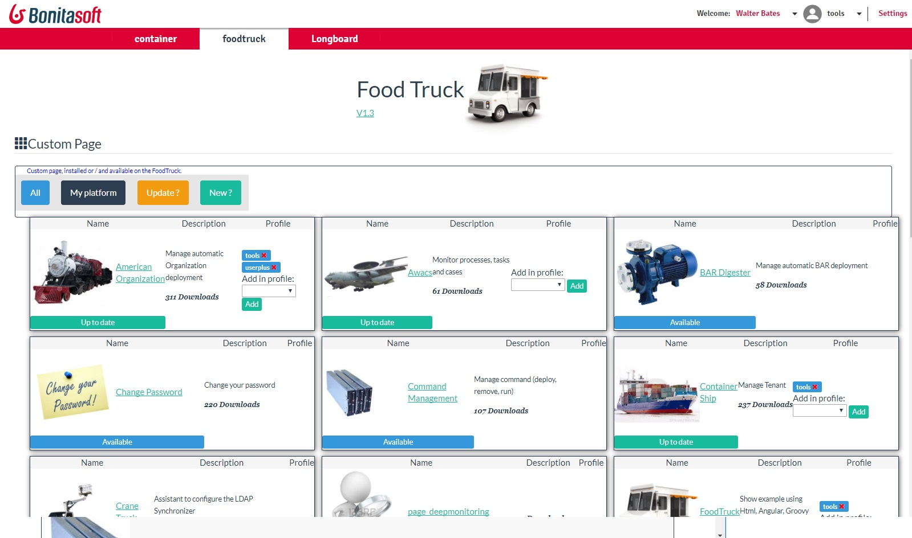

# page_foodtruck

You love Google Play or Apps Store ? FoodTruck, the Bonita Store is ready for you !
Download and install Foodtruck. Then, all available pages in the community are displayed, and  you to install it in a click: Foodtruck download and install it. 
If you give a profile, FoodTruck install for you the page in the profile.
 
 Access FoodTruck time to time : if a new version is publish, then FoodTruck will tell you, and you can install it in a click
 
 
 
 How to publish my own page ? 
 ------------------------------
 Foodtruck search in the Bonita Github Community repository (https://github.com/Bonitasoft-Community)
 Create a project in the Bonita Community Github project. The name must start by "page_" : the foodtruck detect projects started by this name.
*  The description of the page comme from the page.properties file, parameter "description".
* The image is a jpeg image at the root project, with the name "logo.jpg" or "<name>.jpg", where name is the github repository name. For example, for the project "page_american", the logo can be "american.jpg".
* the page itself must be deliver as a release. Inside the release, one file "*.zip" is expected : this must be the custom page.
 Foodtruck order the release by their release date (and not by their name), so you can give the name you want to the release.
 There are no constraint on date description : to detect a new version, FoodTruck compare the local date of installation and the date of the last release to detect that a new version is available.
 
 In the next version, Foodtruck will be able to display the list of all versions and a description per version. So, be sure that the comment associate to the release is correctly set.
 - 
 